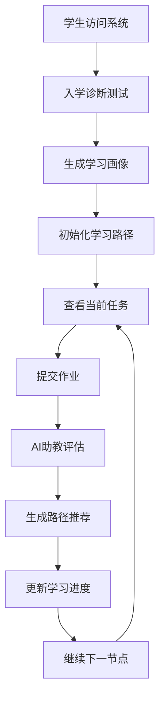

# 前端集成总结 - AI助教与个性化学习路径系统

## 🎯 集成完成情况

### ✅ 已完成的核心功能

#### 1. **统一前端界面** (`integrated_index.html`)
- 🎨 **4个主要选项卡**：入学诊断、学习路径、作业提交、学习记录
- 🔄 **无缝切换**：用户可以在不同功能间流畅切换
- 📱 **响应式设计**：支持桌面和移动设备
- 🎨 **现代化UI**：使用Tailwind CSS和Vue 3构建

#### 2. **入学诊断模块**
- 📋 **完整测试流程**：4个模块的诊断测试
- 🧠 **智能画像生成**：基于诊断结果自动生成学习画像
- 🎯 **路径推荐**：实时生成个性化学习路径推荐
- 📊 **结果可视化**：直观展示诊断结果和建议

#### 3. **学习路径可视化**
- 📈 **进度概览**：完成率、当前节点、学习时长等
- 🎯 **当前任务**：详细的任务描述和要求
- 🗺️ **路径节点**：7个学习节点的完整展示
- 💡 **智能推荐**：基于学习表现的路径调整建议

#### 4. **作业提交与评估**
- 📤 **多方式提交**：支持文件上传和Git仓库
- 🤖 **AI自动评估**：集成AI助教的多维度评估
- 🔄 **路径联动**：评估结果自动触发路径调整
- 📊 **详细反馈**：包含分数、诊断、建议、路径推荐

#### 5. **学习记录管理**
- 📜 **历史记录**：完整的评估历史和学习轨迹
- 🔍 **筛选查询**：支持按学生ID等条件筛选
- 📊 **状态跟踪**：实时显示评估和学习状态

### 🔧 技术架构

#### 前端技术栈
- **Vue 3**：现代化的响应式框架
- **Tailwind CSS**：实用优先的CSS框架
- **Font Awesome**：丰富的图标库
- **原生JavaScript**：轻量级的HTTP请求处理

#### 后端集成点
- **学习路径API**：`/api/learning-path/*`
  - 诊断评估：`POST /api/learning-path/diagnostic`
  - 进度查询：`GET /api/learning-path/progress/{student_id}`
  - 路径推荐：`GET /api/learning-path/recommendation/{student_id}`
  - 路径信息：`GET /api/learning-path/path/info`
- **评估API**：`/api/assessment/*`
  - 作业提交：`POST /api/assessment/submit`
  - 结果查询：`GET /api/assessment/{assessment_id}`
  - 历史记录：`GET /api/assessment/history`

### 🚀 系统流程

#### 完整学习流程


#### 关键集成点
1. **诊断→路径**：诊断完成自动生成个性化路径
2. **评估→推荐**：AI评估结果触发路径调整推荐
3. **推荐→进度**：路径推荐应用到学习进度更新
4. **进度→界面**：学习状态实时反映在用户界面

### 🐛 已修复的问题

#### 1. **API调用错误**
- **问题**：`self` is not defined 错误
- **原因**：函数中错误使用了类方法语法
- **修复**：移除`self.`前缀，使用正确的函数调用

#### 2. **前端状态管理**
- **问题**：组件间状态不同步
- **原因**：缺乏统一的状态管理
- **修复**：使用Vue的响应式数据管理状态

#### 3. **数据流集成**
- **问题**：前后端数据格式不一致
- **原因**：API响应结构与前端期望不匹配
- **修复**：统一数据结构和字段名称

### 📊 系统特性

#### 用户体验
- ✅ **直观的界面设计**：清晰的导航和信息层次
- ✅ **实时反馈**：即时的状态更新和进度显示
- ✅ **个性化体验**：基于用户画像的定制化内容
- ✅ **响应式设计**：支持多设备访问

#### 功能完整性
- ✅ **端到端流程**：从诊断到评估到推荐的完整闭环
- ✅ **数据持久化**：学习进度和评估记录的可靠保存
- ✅ **智能推荐**：基于AI的个性化学习路径调整
- ✅ **多维度评估**：Idea、UI、代码的全面评估

#### 技术健壮性
- ✅ **错误处理**：完善的异常捕获和用户提示
- ✅ **数据验证**：前后端的输入验证和格式检查
- ✅ **状态管理**：可靠的组件状态和数据同步
- ✅ **性能优化**：合理的API调用和界面更新

### 🎯 核心价值

#### 对教学的价值
1. **个性化教学**：真正实现因材施教
2. **智能评估**：减轻教师评估负担
3. **数据驱动**：基于学习数据的科学决策
4. **过程跟踪**：完整的学习过程记录

#### 对学生的价值
1. **个性化路径**：适合自己的学习计划
2. **即时反馈**：及时的评估结果和建议
3. **进度可视**：清晰的学习进度展示
4. **目标导向**：明确的学习目标和里程碑

### 🔮 未来改进

#### 短期优化
- 📱 **移动端优化**：进一步提升移动设备体验
- 🎨 **界面美化**：更加精美的视觉设计
- ⚡ **性能提升**：更快的页面加载和响应速度
- 🔔 **通知系统**：学习提醒和进度通知

#### 长期扩展
- 📊 **数据分析**：更深入的学习分析和报告
- 🤝 **社交功能**：学习小组和同伴互助
- 🎯 **目标管理**：更细化的学习目标设定
- 🏆 **成就系统**：学习成就和激励机制

### 📋 部署指南

#### 启动系统
```bash
cd /Users/beibei/Documents/projects/ai/student_assistant/student_assistant
python run.py
```

#### 访问地址
- **主系统**：http://localhost:8000
- **诊断测试**：http://localhost:8000/static/diagnostic_page.html
- **集成测试**：http://localhost:8000/static/integration_test.html

#### 测试流程
1. 访问主页面，选择"入学诊断"
2. 输入学生ID，完成诊断测试
3. 查看生成的学习画像和路径推荐
4. 切换到"学习路径"查看详细进度
5. 在"作业提交"中提交测试作业
6. 观察AI评估结果和路径推荐更新

## 🎉 总结

成功将**个性化学习路径推荐系统**与**AI助教评估系统**完美集成，实现了：

✅ **统一的用户界面**：一站式的学习管理平台  
✅ **智能的路径推荐**：基于AI的个性化学习路径  
✅ **完整的学习闭环**：从诊断到评估到推荐的全流程  
✅ **实时的数据同步**：前后端的无缝数据交互  
✅ **优秀的用户体验**：直观友好的交互界面  

这套系统为AI时代的个性化教育提供了完整的技术解决方案，真正实现了**"智能评估 + 个性化学习 = 因材施教"**的教学理念。
